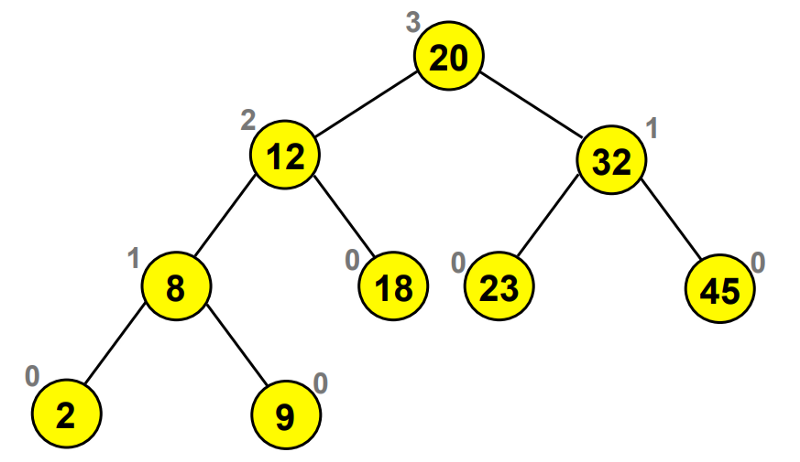

# Read Topics: 15

# Trees

## WHAT

A tree is a hierarchical data structure defined as a collection of nodes. Nodes represent value and nodes are connected by edges.

## WHY

Trees provide a hierarchical structure that allows programmers to organize and represent complex relationships between elements. This is especially useful when dealing with nested structures like expressions, statements, or code blocks.

## HOW

Trees can be used in various ways in programming languages. Here are some common use cases:

1- **Data Structures:** Trees are often used as a fundamental data structure for organizing and storing hierarchical data. For example, file systems on a computer can be represented as a tree structure, where directories are nodes and files are leaves.

2- **Binary Search Trees (BST):** Binary search trees are particularly useful for efficient searching and sorting operations. They allow for fast insertion, deletion, and retrieval of elements, as the tree's structure maintains an order that facilitates these operations.

3- **Syntax Trees:** In programming languages, syntax trees (also known as abstract syntax trees or ASTs) are used to represent the structure of a program's code. Each node represents a specific element of the code, such as variables, functions, or control flow statements.

## Terminology list:

* Node - A Tree node is a component which may contain its own values, and references to other nodes
* Root - The root is the node at the beginning of the tree
* K - A number that specifies the maximum number of children any node may have in a k-ary tree. In a binary tree, k = 2.
* Left - A reference to one child node, in a binary tree
* Right - A reference to the other child node, in a binary tree
* Edge - The edge in a tree is the link between a parent and child node
Leaf - A leaf is a node that does not have any children
* Height - The height of a tree is the number of edges from the root to the furthest leaf

## Diagram Example: 
